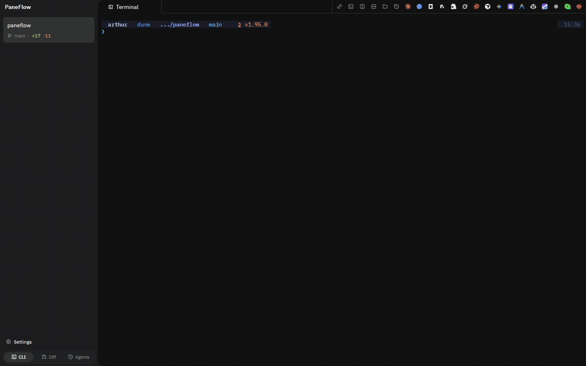

# Paneflow

<p align="center">
  <a href="https://github.com/ArthurDEV44/paneflow"></a>
  <a href="https://github.com/ArthurDEV44/paneflow/releases/latest"></a>
  <a href="https://github.com/ArthurDEV44/paneflow/actions/workflows/run_tests.yml"></a>
  <a href="LICENSE"></a>
  <a href="https://github.com/ArthurDEV44/paneflow/releases"></a>
  
  
</p>

**A native GPUI workspace for running coding agents in parallel.**

Paneflow keeps Claude Code, Codex, Gemini, opencode, and any CLI
agent in real terminal panes you can see, interrupt, and take over. It tracks
which agent is thinking, waiting, stalled, failed, or done; keeps each task tied
to its workspace and branch; and gives agents a local control plane when you
want them to coordinate instead of work blind.

It is open source, written in Rust on [Zed's GPUI](https://github.com/zed-industries/zed/tree/main/crates/gpui),
and ships native builds for Linux, macOS Apple Silicon, and Windows x64. No
Electron. No WSL required. No hosted agent runtime.

<p align="center">
  <a href="#install">Install</a> ·
  <a href="#why-paneflow">Why Paneflow</a> ·
  <a href="#core-workflows">Core workflows</a> ·
  <a href="#safety-model">Safety model</a> ·
  <a href="#docs">Docs</a> ·
  <a href="#faq">FAQ</a>
</p>

<p align="center">
  
</p>
<p align="center">
  <sub>Several coding agents running in parallel panes, with live status for who is thinking, running, waiting, or done.</sub>
</p>

## Install

Release builds are attached to the
[latest GitHub release](https://github.com/ArthurDEV44/paneflow/releases/latest).
You do not need Rust unless you are building from source.
Asset filenames use the version without the leading `v` from the Git tag
(`paneflow-0.7.2-x86_64.AppImage`, not `paneflow-v0.7.2-...`).

| Platform | Recommended path | Status |
|---|---|---|
| Linux x86_64 / aarch64 | AppImage, `.deb`, `.rpm`, or `.tar.gz` | Active: Wayland and X11 |
| macOS Apple Silicon | Signed and notarized `.dmg` | Active |
| macOS Intel | Not shipped today | Planned to return when the release matrix reopens it |
| Windows x64 | Signed `.msi` | Active: Windows 10 1809+ and Windows 11 |
| Windows ARM64 | Not shipped today | Deferred pending GPUI DX11 ARM64 reliability |

### Linux quickstart

```bash
VER=$(curl -fsSL https://api.github.com/repos/ArthurDEV44/paneflow/releases/latest \
      | grep -oE '"tag_name":\s*"v[^"]+"' | cut -d\" -f4 | sed 's/^v//')
ARCH=$(uname -m)
curl -LO "https://github.com/ArthurDEV44/paneflow/releases/latest/download/paneflow-${VER}-${ARCH}.AppImage"
chmod +x "paneflow-${VER}-${ARCH}.AppImage"
./paneflow-${VER}-${ARCH}.AppImage
```

On Ubuntu 24.04+ or immutable distros, run the AppImage with
`--appimage-extract-and-run` if FUSE 2 is unavailable. `.deb`, `.rpm`,
`.tar.gz`, SHA-256 sidecars, and Minisign signatures are published with each
release.

### macOS

Download `paneflow-X.Y.Z-aarch64-apple-darwin.dmg` from the
[latest release](https://github.com/ArthurDEV44/paneflow/releases/latest), open
it, and drag `PaneFlow.app` into `/Applications`.

A Homebrew tap is available:

```bash
brew tap arthurdev44/paneflow
brew install --cask paneflow
```

If the cask lags a fresh release, use the DMG directly.

### Windows

Download `paneflow-X.Y.Z-x86_64-pc-windows-msvc.msi` from the
[latest release](https://github.com/ArthurDEV44/paneflow/releases/latest) and
double-click it. The MSI is signed; verify it with:

```powershell
signtool verify /pa /v paneflow-X.Y.Z-x86_64-pc-windows-msvc.msi
```

See [docs/WINDOWS.md](docs/WINDOWS.md) for the supported Windows matrix and
known platform caveats.

## Why Paneflow

Starting coding agents is easy. Keeping a reliable view of ten running sessions
is the hard part: which one is waiting on you, which branch it touched, which
test output belongs to which task, and how to hand context from one agent to
another without copy-pasting terminal scrollback.

Paneflow is built around that coordination problem:

- Real terminal panes for every agent, so nothing is hidden behind a chat-only
  abstraction.
- Live agent state from hooks and IPC, not a vague "terminal is active"
  heuristic.
- Workspaces and git branches visible in the app chrome.
- A review surface for comparing worktree diffs side by side.
- A read-only MCP bridge so one agent can inspect another pane's output.
- A local CLI and JSON-RPC control plane for scripted orchestration.

The goal is not to replace your editor or your shell. It is to make parallel
agent work observable enough that you can supervise it without losing context.

## Core workflows

### Run agents side by side

Launch Claude Code, Codex, Gemini, opencode, Pi, Hermes, or any CLI
agent in a real PTY pane. Paneflow keeps the raw terminal visible while adding
the app-level state you need for multi-agent work: workspace, branch, title,
status, notifications, and session restore.

### See what needs attention

The sidebar, tab dots, desktop notifications, Attention Queue, and Rosetta
surface turn scattered agent events into a readable queue: waiting for input,
running, stalled, errored, or recently finished. Rosetta is the in-app status
surface for agent notifications and can stay quiet unless something needs your
attention.

### Coordinate a fleet with Conductor

The `paneflow` CLI talks to the same local socket as the app:

```bash
paneflow ps
paneflow read cargo-run --lines 100
paneflow watch --json
paneflow send codex-review "Review this branch and report risks"
paneflow wait --surface claude-impl --pattern "REPORT_DONE"
paneflow flow run examples/review-pipeline.flow.toml
```

`paneflow up` can spawn declarative workspaces, and `paneflow flow run` executes
a `flow.toml` DAG with spawn, wait, send, capture, and review steps. By default
Paneflow pre-fills prompts and a human presses Enter. Auto-submit is explicit
and gated.

### Let agents read each other safely

`paneflow mcp install` registers a local read-only MCP bridge for supported CLI
agents. It exposes:

- `list_panes`
- `read_pane`
- `search_pane`

The bridge cannot type into panes or control them. Returned terminal output is
wrapped as untrusted data so downstream agents know to analyze it, not obey it.
The tool manifests live in [mcps/paneflow/tools](mcps/paneflow/tools).

### Review worktree diffs in one place

When each agent works in its own branch or worktree, Paneflow can show the
resulting diffs side by side: one column per worktree, with hunk navigation,
branch review prompts, attribution, and local cost estimates where token usage
is available.

## Feature map

| Area | What Paneflow gives you |
|---|---|
| Terminal workspace | Splits, tabs, resize, layout presets, session restore, markdown panes |
| Agent state | Thinking, waiting, finished, errored, stalled, notifications, Rosetta |
| Review | Worktree diff columns, hunk navigation, review prompts, cost estimate |
| Automation | CLI, JSON-RPC socket, `paneflow up`, `paneflow flow run`, event stream |
| Agent context | Read-only MCP bridge with `list_panes`, `read_pane`, `search_pane` |
| Native runtime | Rust, GPUI, `alacritty_terminal`, Vulkan / Metal / DirectX |
| Trust | GPL-3.0-or-later, signed release artifacts, opt-in telemetry |

## Safety model

Paneflow is intentionally local-first.

- Agents run as normal CLI processes inside normal PTYs.
- The UI is a supervisor surface, not a hosted agent runtime.
- Prompt prefill is the default; auto-submit is opt-in.
- IPC writes are gated behind explicit scripting access.
- MCP tools are read-only.
- Terminal output returned to agents is marked as untrusted.
- Telemetry is opt-in and can be disabled unconditionally with
  `PANEFLOW_NO_TELEMETRY=1`.
- Release artifacts ship with checksums and detached Minisign signatures.

## Build from source

Paneflow pins Rust 1.96.1 through [rust-toolchain.toml](rust-toolchain.toml).

```bash
git clone https://github.com/ArthurDEV44/paneflow.git
cd paneflow
cargo build --release -p paneflow-app
cargo run -p paneflow-app
```

Useful development checks:

```bash
cargo fmt --check
cargo test --workspace
cargo clippy --workspace -- -D warnings
```

Linux builds need Vulkan and the usual Wayland/X11 development libraries. macOS
and Windows packaging have extra signing and bundling steps documented in the
release runbooks.

## Docs

- [paneflow.dev](https://paneflow.dev) - product site and public docs
- [ARCHITECTURE.md](ARCHITECTURE.md) - runtime architecture and thread model
- [docs/mcp-bridge.md](docs/mcp-bridge.md) - MCP bridge behavior and install
- [docs/WINDOWS.md](docs/WINDOWS.md) - Windows support matrix and caveats
- [docs/release/linux-signing.md](docs/release/linux-signing.md) - Linux release verification
- [docs/release/macos-signing.md](docs/release/macos-signing.md) - macOS signing and notarization
- [docs/release/windows-signing.md](docs/release/windows-signing.md) - Windows MSI signing
- [AGENTS.md](AGENTS.md) - repository instructions for coding agents
- [llms.txt](llms.txt) - compact map for AI agents and crawlers

## Compare

| Tool family | Strength | Paneflow difference |
|---|---|---|
| tmux / terminal tabs | Universal shell multiplexing | Paneflow adds agent state, workspaces, review, sidebars, and MCP |
| WezTerm / iTerm2 / Ghostty | Great terminals | Paneflow focuses on supervising several agent sessions in one project window |
| Warp-style AI terminals | Polished single-terminal AI workflows | Paneflow keeps existing CLI agents visible in raw PTY panes |
| cmux-style agent workspaces | Multi-agent coordination | Paneflow is independent Rust/GPUI, cross-platform, and local-first |

Detailed comparisons live at [paneflow.dev/compare](https://paneflow.dev/compare).

## FAQ

**Why not tmux with one agent per pane?**
Use tmux if you mostly work over SSH or want a headless multiplexer. Paneflow is
for local GUI supervision: agent state, notifications, MCP pane reads, worktree
review, and a native control plane around real terminals.

**Is this another Electron app?**
No. Paneflow is Rust on GPUI with Vulkan on Linux, Metal on macOS, and DirectX
on Windows.

**Does Paneflow drive agents for me?**
Only when you explicitly enable that flow. The default is visible terminal
control: prompts are pre-filled, you review them, then you press Enter.

**Can agents read sensitive terminal output?**
Only agents you configure through the MCP bridge can read pane output, and the
bridge is read-only. Treat that as powerful local context access: useful for
coordination, but still something to enable intentionally.

**Does it phone home?**
Not unless you opt in. Telemetry never includes terminal contents, paths, or
prompts, and `PANEFLOW_NO_TELEMETRY=1` disables it regardless of config.

**What about Windows?**
Windows x64 is a first-class release target. Windows ARM64 is not shipped yet.
See [docs/WINDOWS.md](docs/WINDOWS.md) for the support matrix and known issues.

**Why GPL-3.0-or-later?**
Paneflow is meant to stay open. GPL keeps improvements to the app in the
commons while allowing normal internal and commercial use.

## License

[GPL-3.0-or-later](LICENSE)
